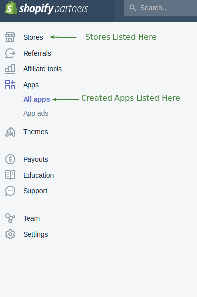

# Shopify Developers

## Contents

<!-- toc -->

- [Shopify Developers](#shopify-developers)
  - [Contents](#contents)
  - [Starter References](#starter-references)
  - [Getting Started](#getting-started)
  - [Shopify CLI, Partner Account & Development Store](#shopify-cli-partner-account--development-store)
  - [Shopify Apps](#shopify-apps)
  - [Creating Node & React (Public) Shopify App](#creating-node--react-public-shopify-app)
    - [Why Embed App instead of Standalone App](#why-embed-app-instead-of-standalone-app)
  - [Listing Your Apps and Stores](#listing-your-apps-and-stores)
  - [Files & Folders](#files--folders)
    - [.env file](#env-file)
    - [server](#server)
      - [server/server.js](#serverserverjs)
      - [server/handlers/client.js](#serverhandlersclientjs)
      - [server/handlers/register-webhooks.js](#serverhandlersregister-webhooksjs)
      - [server/handlers/mutations](#serverhandlersmutations)
    - [pages](#pages)
    - [pages/index.js](#pagesindexjs)
  - [Polaris](#polaris)

<!-- tocstop -->

## Starter References

- [Shopify Developers](https://shopify.dev/apps/tools)
- [Shopify CLI](https://shopify.dev/apps/tools/cli)
- [Shopify Partner Account](https://www.shopify.ca/partners)
- [Creating a Shopify App with Node and React](https://www.youtube.com/watch?v=PIXN032XJJ8&t=478s)(little outdated)
- [ShopifyDevs Youtube Channel](https://www.youtube.com/channel/UCcYsEEKJtpxoO9T-keJZrEw)

## Getting Started

We need the following, read more about the `Shopify CLI, Partner Account & Development Store` below

- Shopify CLI
  - Ruby
  - Shopify Partner Account
  - Shopify Development Store
- Ngrok

> `Important:` I had some issues with installing the CLI as instructed on their website. Had to use `dpkg` to run the `deb` file instead of `apt install`

## Shopify CLI, Partner Account & Development Store

`Shopify CLI` helps us spin up a shopify app from the cli using ruby on rails or nodejs

- It integrates directly with `shopify partner account`

- As well as handling Authentication & installing the app into `shopify development store`

- You just need one partner account (can have many) and can create many stores per account

- `Shopify CLI` can also automates common develoment tasks:
  - Populate example data such as products and customers
  - Generate boiler code inside our app like
    - call to a billing API
    - calling webhooks

## Shopify Apps

They are basically apps shopify merchants can add to their website. There are 2 types of apps

1. Public Apps

   - Sold through shopify app store
   - Goes through review process, before they can be listed there

2. Custom Apps

   - Build for single merchant
   - Can't be sold in app store
   - No review process

## Creating Node & React (Public) Shopify App

- [Youtube Video: Creating a Shopify App with Node and React](https://www.youtube.com/watch?v=PIXN032XJJ8&t=478s)(Uses Outdated Shopify CLI)
- [Node.js App Commands](https://shopify.dev/apps/tools/cli/node-app)

```bash
# Login to partner account, will bring up website
# Once signed in, will be asked to select partner account in CLI
shopify login

# create app
shopify node create
? App name
> ssaquif-first-app
? What type of app are you building?
> 1. Public: An app built for a wide merchant audience.
  2. Custom: An app custom built for a single client.
? Select partner organization
# Choose One
? Select a development store
# Choose a non-archived one

# cd in to the created app folder
# start the node app
shopify node serve

# Q1: I choose yes. This wasn't there in the video
? Do you want to convert ssaquif-first-store.myshopify.com to a development store?
Doing this will allow you to install your app, but the store will become transfer-disabled.
Learn more: https://shopify.dev/tutorials/transfer-a-development-store-to-a-merchant#transfer-disabled-stores
 (You chose: yes)
✓ Transfer has been disabled on ssaquif-first-store.myshopify.com.
✓ curl @ /home/sadnan/anaconda3/bin/curl
✓ unzip @ /usr/bin/unzip
✓ Installing ngrok…
✓ ngrok tunnel running at
⭑ This tunnel will timeout in 1 hours 59 minutes
⭑ To avoid tunnels that timeout, it is recommended to signup for a free ngrok
account at https://ngrok.com/signup. After you signup, install your
personalized authorization token using shopify [ node | rails ] tunnel auth <token>.
✓ .env saved to project root

# Q2: Also chose yes, cause the video did
? Do you want to update your application url? (You chose: yes)
✓ Whitelist URLS updated in Partners Dashboard

⭑ To install and start using your app, open this URL in your browser:
https://2f86-142-127-37-63.ngrok.io/auth?shop=ssaquif-first-store.myshopify.com
```

After that folow the link , first time it will take you the development store and go ahead and click on `install unlisted app`

This will take us to the boilerplate app, then will be quicky redirected to the shopify development store admin with the app imbedded in it.

### Why Embed App instead of Standalone App

By embedding the app in shopify admin

- you can create a more familiar and easy to use user experience for shopify merchants
- makes experience more consitent in regards of what device is used to view the app

## Listing Your Apps and Stores

You can find a list of apps and stores from the shopify partner account sidebar as shown below


## Files & Folders

### .env file

Our keys and the host the ngrok url. All private info as usual.

### server

Our backend components

#### server/server.js

Apparently don't have to change anything here

Uses next.js, koa and authenticated using open authorization (oAuth) the token based autorization system.

Uses `koa` with `koa-shopify-auth` middleware to take of most of the authentication process and create the custom server

(This is not present in the node app created by version 2.2.2 shopify cli) Uses `koa-shopify-graphql-proxy` to securely proxy graphql requests from shopify

#### server/handlers/client.js

App is set to use Apollo to fetch data

And The Apollo Client and it's react components were designed to let you quickly build a React UI that fetches data using GraphQL

#### server/handlers/register-webhooks.js

> This is not present in the node app created by version 2.2.2 shopify cli

Some scaffolding code to setup webhooks

#### server/handlers/mutations

We have some code that will make calls to billing app when we setup billing for our apps which we can do through the cli

### pages

Holds our FE components

Next.js uses an app component to pass down classes to other files in our app.

There are a few different provider components (Apollo, Polaris, app-bridge), they wrap the entire app. Needed to use their respective libraries in our app.

### pages/index.js

The start of our app

## Polaris

Polaris is a Design System
